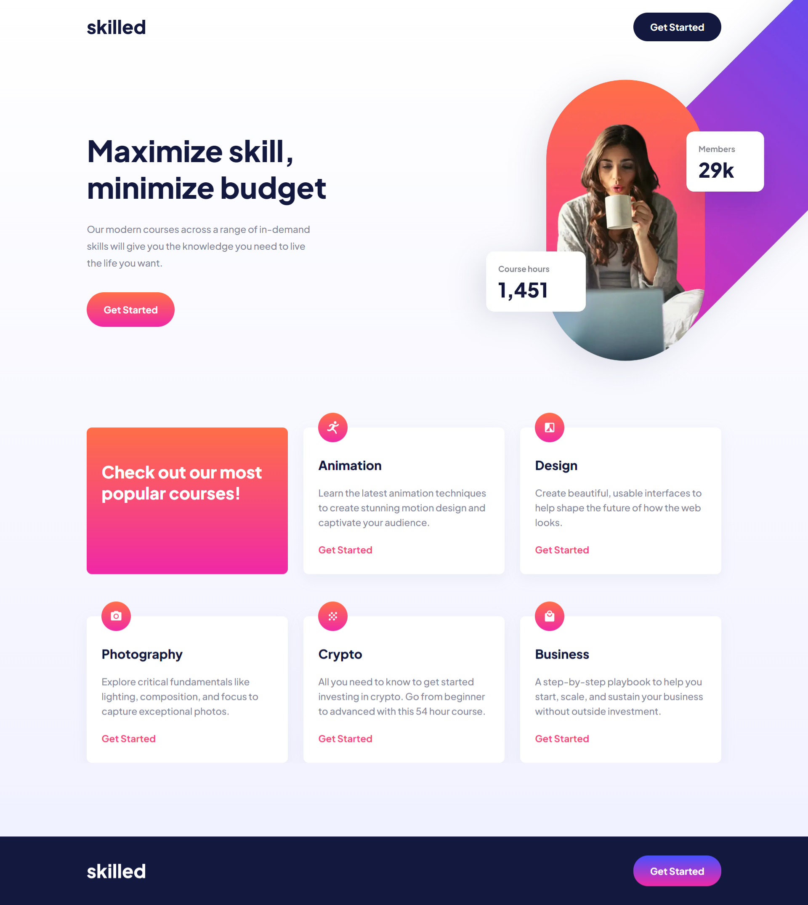

# Frontend Mentor - Skilled e-learning landing page solution

This is a solution to the [Skilled e-learning landing page challenge on Frontend Mentor](https://www.frontendmentor.io/challenges/skilled-elearning-landing-page-S1ObDrZ8q). Frontend Mentor challenges help you improve your coding skills by building realistic projects.

## Table of contents

- [Overview](#overview)
  - [The challenge](#the-challenge)
  - [Screenshot](#screenshot)
  - [Links](#links)
- [My process](#my-process)
  - [Built with](#built-with)
  - [What I learned](#what-i-learned)
  - [Continued development](#continued-development)
- [Author](#author)

## Overview

### The challenge

Users should be able to:

- View the optimal layout depending on their device's screen size
- See hover states for interactive elements

### Screenshot

### Links

- Solution URL: [https://www.frontendmentor.io/solutions/skilled-elearning-landing-page-responsive-using-grid-flex-and-mediaq-DeJk3p33K0](https://www.frontendmentor.io/solutions/skilled-elearning-landing-page-responsive-using-grid-flex-and-mediaq-DeJk3p33K0)
- Live Site URL: [https://sircarloschaves.github.io/skilled-elearning-landing-page/](https://sircarloschaves.github.io/skilled-elearning-landing-page/)

## My process

### Built with

- Semantic HTML5 markup
- CSS custom properties
- Flexbox
- CSS Grid
- Mobile-first workflow

### What I learned

For the first time I practiced the difference between the 3 layouts: Mobile, Tablet and Desktop.
I managed to assimilate the use of the grid in the layout well.

### Continued development

Because I faced a difficulty in positioning the main image on the desktop, I will practice this part a lot more so that I will soon use better techniques to do the same.

I also want to make typography 100% responsive for much larger screens in future projects.

## Author

- Github - [sircarloschaves](https://github.com/sircarloschaves)
- Frontend Mentor - [@sircarloschaves](https://www.frontendmentor.io/profile/sircarloschaves)
- Twitter/X - [@carloschavesdev](https://twitter.com/carloschavesdev)
